# Timing and Synchronisation Between Different PCs in an MEG Setup

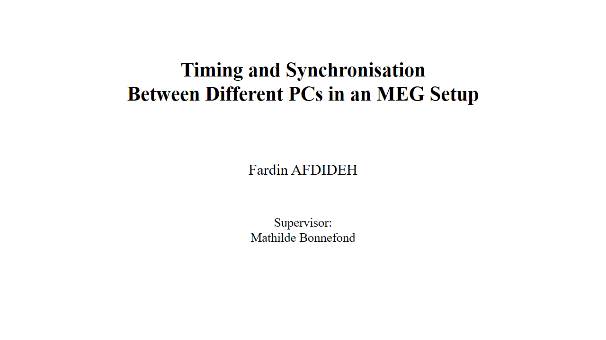
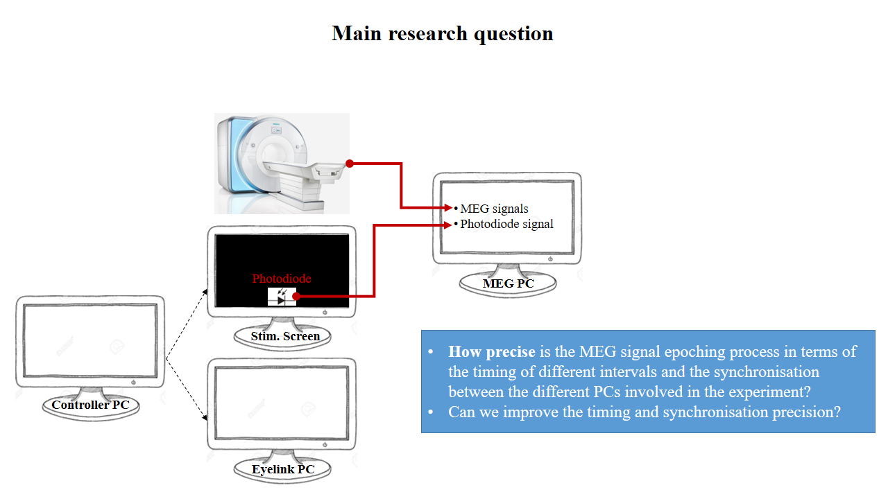
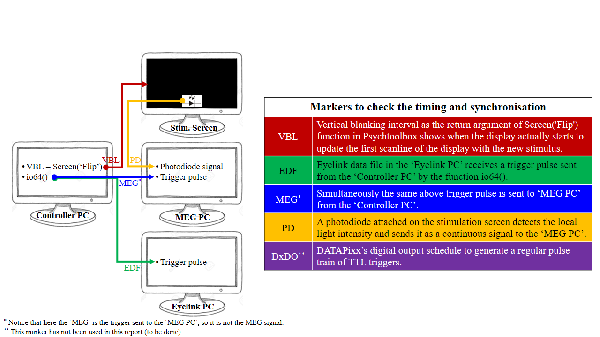
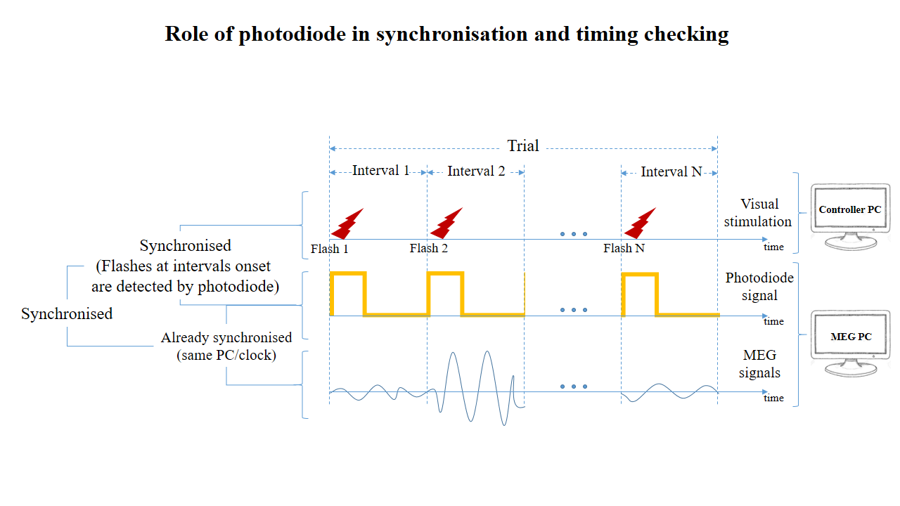
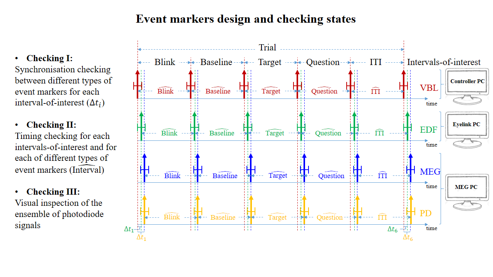
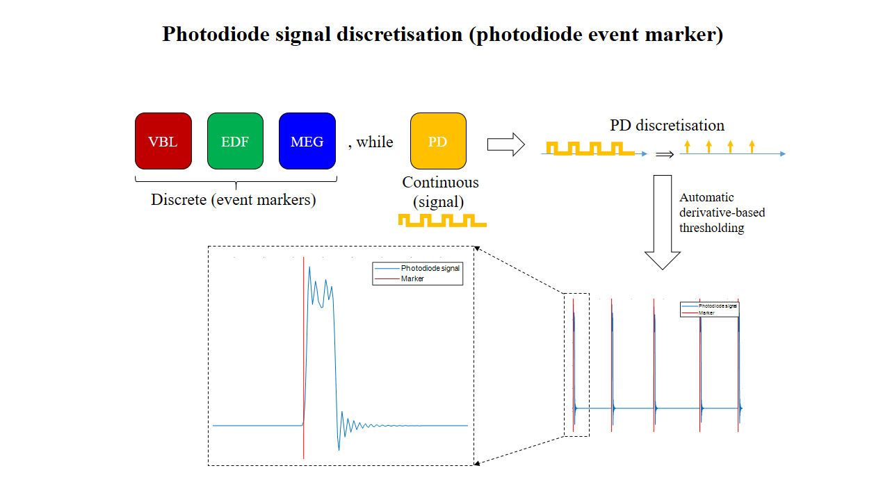
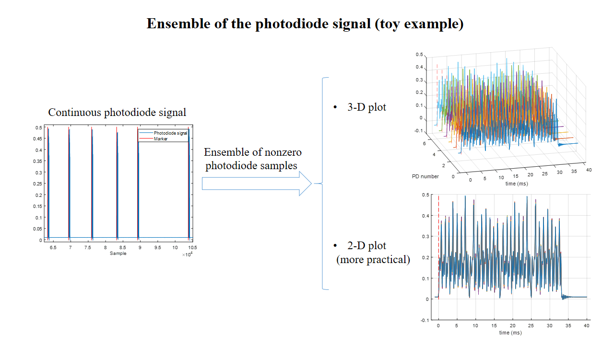
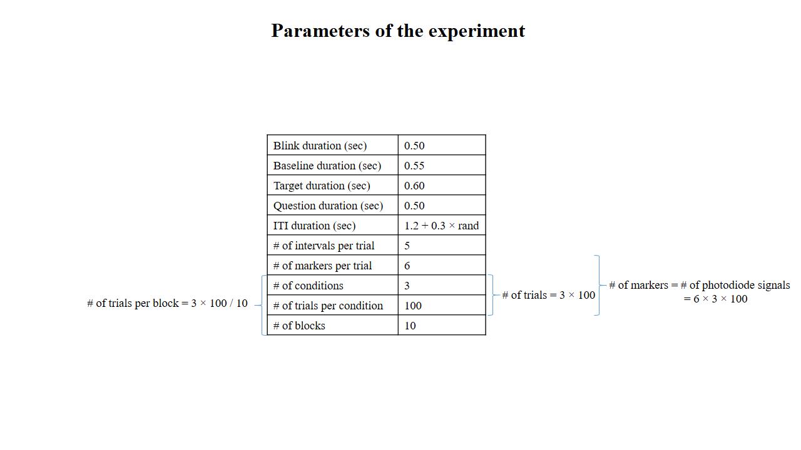
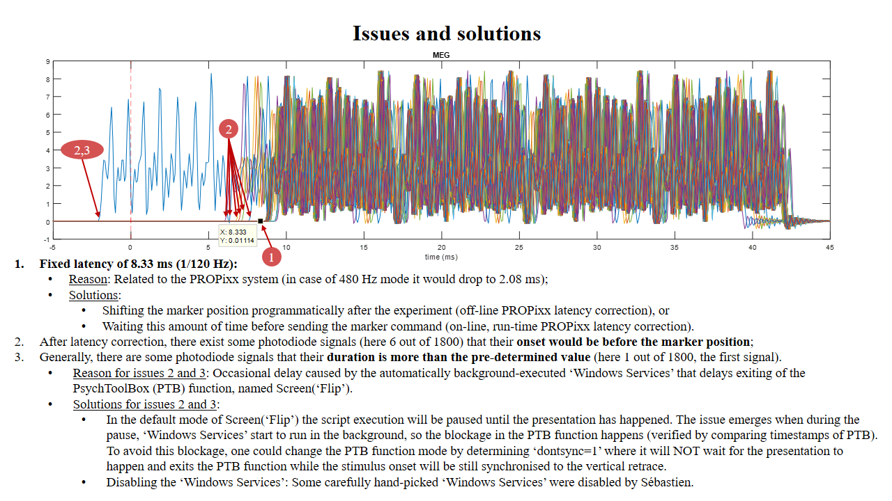
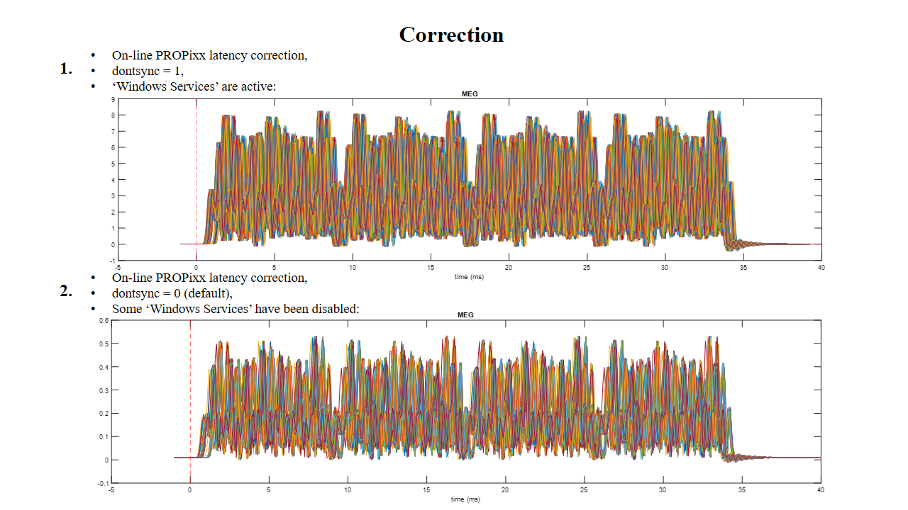
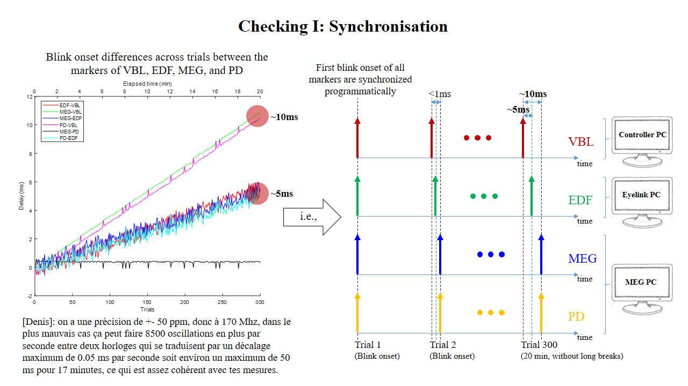
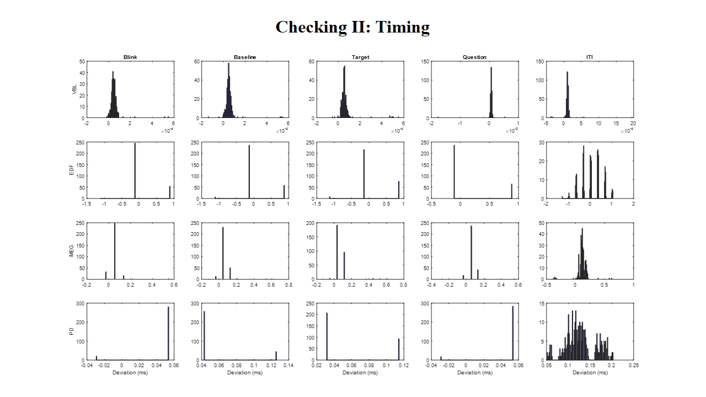
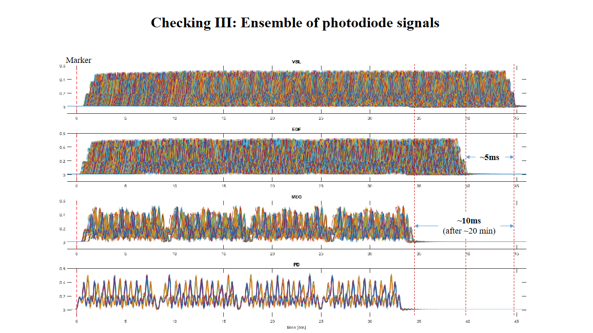
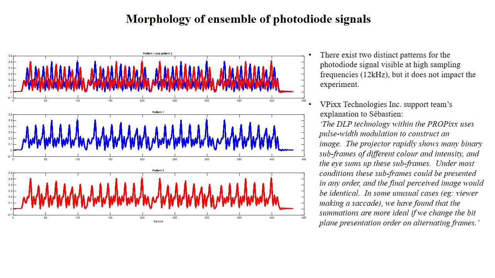
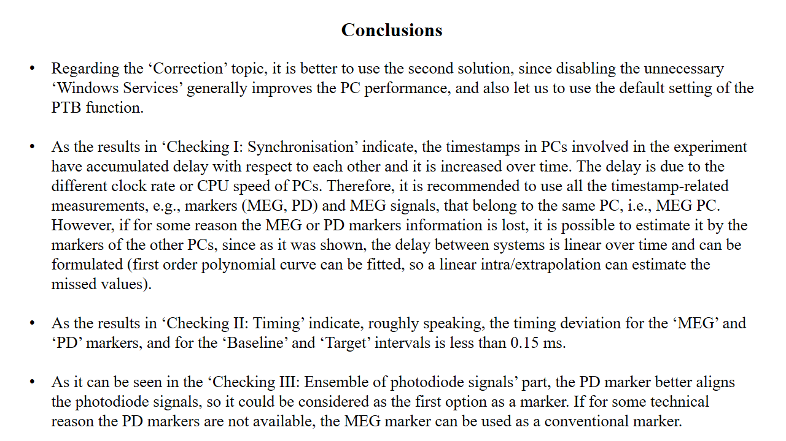
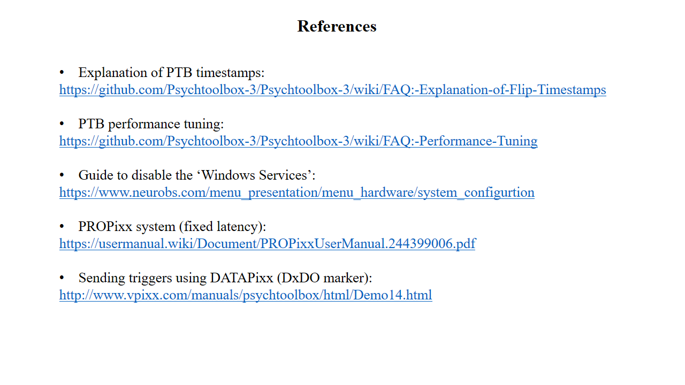

# How to cite
* F. Afdideh et al., "Timing and Synchronisation Between Different PCs in an MEG Setup", unpublished.
